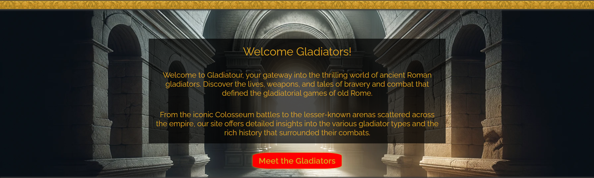
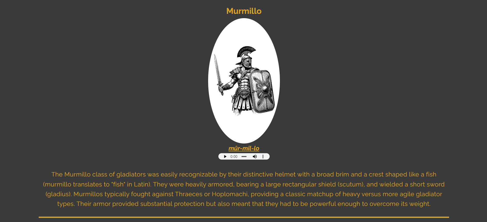
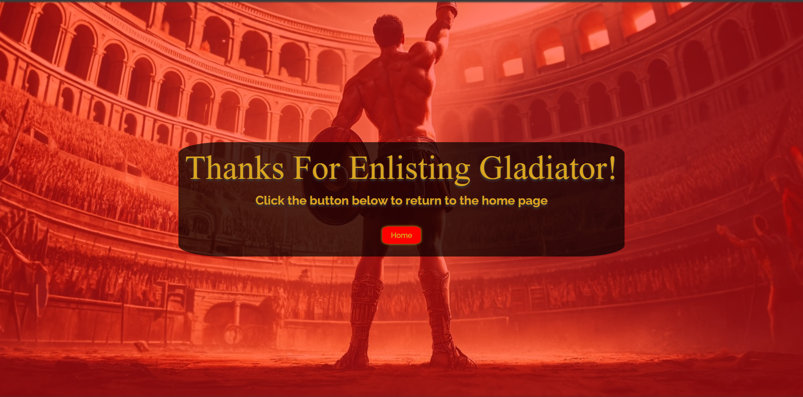

# Gladiatour

Gladiatour is an educational website designed to immerse visitors into the interesting history of th gladiatorial games and the people who fought in them. The site has accessibility as one of it's key features meaning not only should it flow nicely but it should be enjoyable to all, more of these features will be highlighted below.

My hope is that with the information provided, and the way in which it is presented, more people will be encouraged to go and delve even deeper into this extraordinary part of our shared past.

## Design

Please see below the original mockups of the site made using Balsamiq Wireframes.

- Site Layout Draft

- Main Page Mockup

- Information Page Mockup

    - The design for the information page has changed from my initial designs due to user feedback about ease of use and readability.

- Signup Page Mockup

- Thank You Page Mockup

## Features

Below I will go into a brief explanation of the features I have encorporated into the site.

### Existing Features

- __Navigation Bar__

    - Shown at the top of all pages within the site, the navigation or 'nav' bar will make traversing the site as easy as it can be without having to resort to using any of the browsers navigation options.
    - The nav bar is also fully responsive meaning even when viewing on a mobile or tablet it should be just as easy without sacraficing the quality of the experience.

- __Landing Page__

    - The landing page has been designed in a way that really captures the grandeur of ancient rome with vibrant colours which compliment eachother whislt also staying loyal to the source content.
    - Below the main heading of the landing page is a brief introduction to the website aswell as giving an ideal starting point through the site in the way of a button to the information page.

- __Gladiators Page__

    - The Gladiators page is designed to flow easily from the landing page so as to keep the same feeling throughout the whole site.
    - All images within this page have been styled the same in order to keep the page uniform and maintain quality.
    - Below each image an audio control can be found which plays an audio clip of the pronunciation of the names in a phonetic style.

- __Sign Up Page__

    - The sign up page was designed to be as simple as possible whilst still keeping the overall feel of the site. 
    - Minimal usage of elements was chosen to make best use of the background image to encourage a feeling of positivity and victory.

- __Thank You Page__

    - A thank you page has been implemented to show once a user has successfully signed up to enforce a positive response from the user.
    - The custom message thanks the user for signing up whilst also giving them a button to return the main page.

- __The Footer__

    - The footer has been designed to keep in line with the navbar of a minimal look using the exact same colours and styles.
    - Icons have been used rather than words as the pages they link to have become second nature to most users.

- __404 Error Page__

    - The 404 error page has been designed to be simple but stay within the design of the rest of the site.
    - A button directing back to the main page has been implemented and has the same styling as all other primary buttons.

### Features Not Yet Implemented

- __Gladiator Dropdown__

    - I had planned to implement a dropdown on the gladiators information page to work on smaller screens much like the nav menu.
    - This would have only shown the relevant information for the chosen gladiator rather than having the whole page as a long scrollable page.

## Testing

During the whole development cycle I have been making sure to test each new feature from a minimum mobile size of 400px up to standard desktop and laptop sizes.
As seen above, the major changes between mobile and desktop sizes are the main nav bar dropdown feature which will trigger when being accessed on tablet size screens and smaller. The other responsive features are the size of fonts for all main content and headings, this has been tested thoroughly across all pages to make sure the users will have the best experience regardless of screen size.

The biggest challenge that was faced during the testing of responsiveness, other than the main nav bar, was the sign up form, which I wished to keep the same overall feel without changing the layout of the form too much, if at all.

### Validator Testing

- __HTML__
    - No errors were returned when passing through the official [W3C validator](https://validator.w3.org/nu/?doc=https%3A%2F%2Fshlackka.github.io%2FGladiatour%2F)
- __CSS__
    - No errors were returned when passing through the official [(Jigsaw) validator](https://jigsaw.w3.org/css-validator/validator?uri=https%3A%2F%2Fshlackka.github.io%2FGladiatour%2F&profile=css3svg&usermedium=all&warning=1&vextwarning=&lang=en)

### Unfixed Bugs

To the best of my knowledge after testing all aspects of the site I have been unable to find any unfixed bugs.

## Deployment

## Credits

### Content

### Media